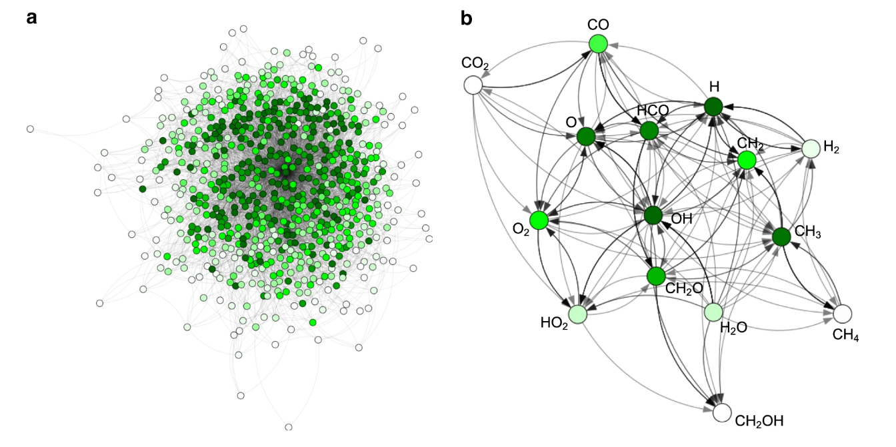
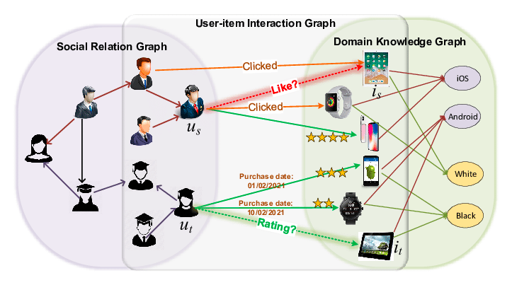
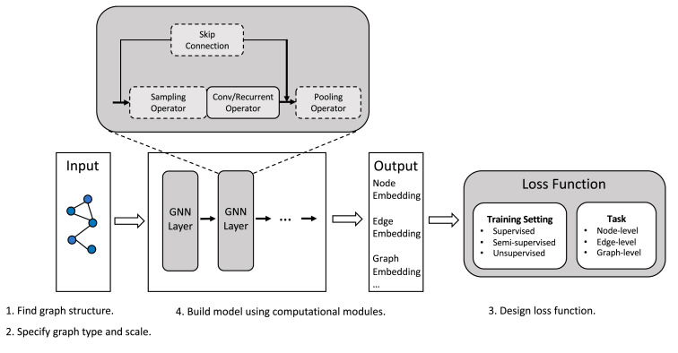
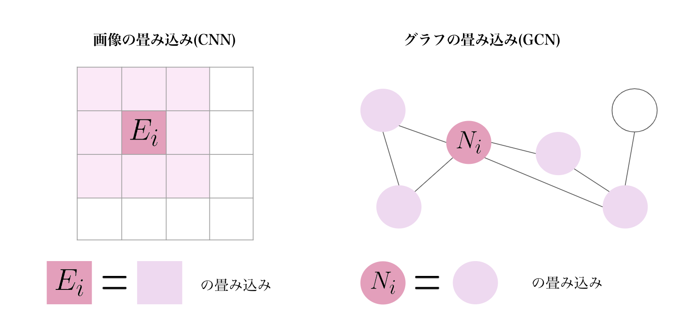
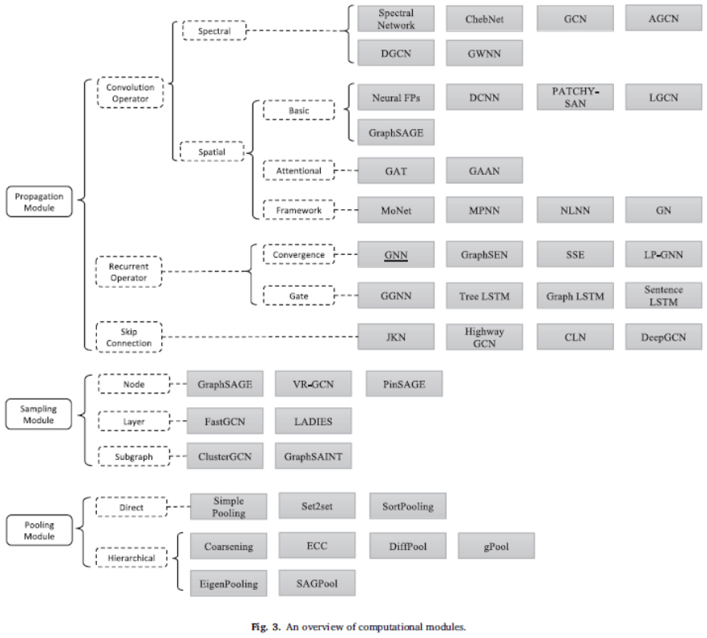
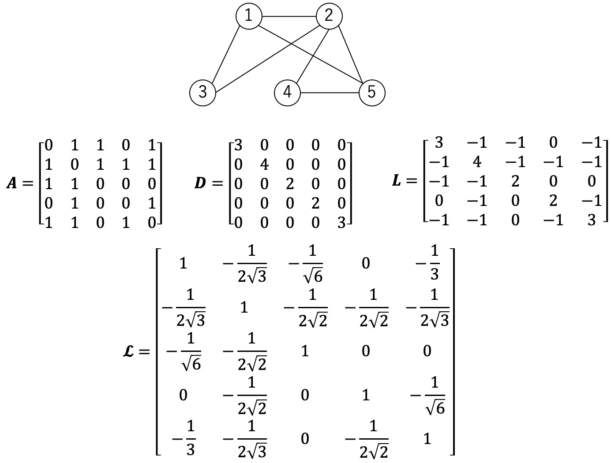

# 1. GNN および GCN

## 1.1. 　グラフニューラルネットワーク(GNN)とは

グラフニューラルネットワークとは、グラフデータをニューラルネットワークで扱うものの総称

(※GNN という元々 model があったが、最近では広義的な意味で使用されている)

### 1.1.1. 　使用例

- 化学反応の予測
- レコメンドシステム
  - ユーザーとアイテムの関係性（クリックしたか・購入したか・お気に入り登録したか等）をグラフの辺としてみなす
  - このグラフ構造に対して GNN を適用することで、従来の手法よりも性能の高いレコメンドシステムを構成

  
  

### 1.1.2. GNN(model) の構成

1. 学習データとなるグラフを入力
2. 入力として与えられたグラフに対して、「GNN Layer」を複数適用
3. 得られた埋め込み表現(Embedding)を用いて学習時に損失(loss)を計算したり、推論時に予測

## 1.2. GNN と GCN の違い

### 1.2.1. GNN

- 特徴
  - グラフ構造を持つデータに対してノードやエッジの特徴量を再帰的に更新するためのネットワーク
  - 固定された関数とパラメータによって特徴量を更新
  - 一つのモデルで同じパラメータを使用
  - ノードとエッジの情報を考慮して特徴量を更新

### 1.2.2. GCN

- 特徴
  - グラフ構造を持つデータに対して畳み込みニューラルネットワークを適用する手法
  - 多層構造で各層で異なるパラメータを用いて特徴量を更新
  - 各層で異なるパラメータを使用するため、モデルの表現力が高まる
  - ノード間の関係を考慮して特徴量を更新

### 1.2.3. 　相違点

- GNN では、固定された関数および、固定されたパラメータで特徴量を更新するが、GCN では、多層構造で各層で異なるパラメータを用いて特徴量を更新
- GNN では、畳み込みを行わない。GCN では、フィルタの畳込みをグラフ上で行う
  - 畳み込み：局所的な特徴量の抽出。画像では隣接するピクセル間の関係性があり、エッジや色の変化といった局所的な特徴を検出。グラフでは、隣接するノードから注目ノードの特徴量を検出
    
- 実用上では、GCN の方が使われる?(場合により)

#### 補足

- グラフ畳み込みの 2 つのアプローチ
  - Spectral-based
    - グラフ信号処理の立場からフィルタを導入してグラフ畳み込みを定義
    - 長所・短所:理論的な裏付け・行列の固有値分解が計算量大
  - Spatial-based
    - 近傍のノードから特徴情報を集める処理としてグラフ畳み込みを定義
    - 長所・短所:直感的に理解しやすい・非常に多くのバリエーション

そもそも、講義的な GNN は以下の数だけある

  

## 1.3. 数式を用いた説明

### 1.3.1. 前提

- グラフ $G=(V, E)$

- 隣接行列 $\boldsymbol{A} = (a_{ij})$

$$
\begin{equation}
a_{ij} =
\begin{cases}
1   &   ((i,j)\in E) \\
0   &   (otherwise)
\end{cases}
\end{equation}
$$

を満たす重みなしのグラフを考える

ラプラシアン行列
$\boldsymbol{L} = \boldsymbol{D} - \boldsymbol{A}$

$\boldsymbol{D}$: 次数行列(degree matrix)

正規化ラプラシアン行列
$\boldsymbol{\mathcal{L}} = \boldsymbol{D}^{- \frac{1}{2}}  \boldsymbol{L} \boldsymbol{D}^{- \frac{1}{2}} = \boldsymbol{I} - \boldsymbol{D}^{- \frac{1}{2}}  \boldsymbol{A} \boldsymbol{D}^{- \frac{1}{2}}$

(例)

  

### GNN の計算

ノード
$i$
の潜在ベクトル
$\boldsymbol{h}_i$
を求める

1. 学習される関数である
   $\mathcal{F()}$
   を用いて, 潜在ベクトル
   $\boldsymbol{h}_i$
   が収束するまで次の式を適用. これによってノード
   $i$
   の周辺の特徴を取り込む。

   $\boldsymbol{h}\_i \leftarrow  \sum_{j \in \mathcal{N}(i)} \mathcal{F}(\boldsymbol{h}_i, \boldsymbol{h}_j, \boldsymbol{F}_i^V, \boldsymbol{F}_j^V,\boldsymbol{F}^E _{i, j})$

   $\mathcal{F}$: 学習される関数

   $\boldsymbol{F}^V, \boldsymbol{F}^E$:ノード、エッジの特徴

   $\mathcal{N}_i(k)$: ノード $i$ から距離 $k$ 以内にあるノードの集合

2. 学習される関数 $\mathcal{O()}$ であるを用いて, 出力を計算.

$$
\begin{equation}
\hat{y}_i = \mathcal{O}(\boldsymbol{h}_i \boldsymbol{F}_i^V)
\end{equation}
$$

重みは, $\hat{y}_i$と教師ラベルの誤差を最小化するようにステップ 1, 2 と誤差逆伝搬を繰り返すことで学習される

### GCN の計算

- 入力
  - 隣接行列
    $\boldsymbol{A} \in \mathbb{R}^{n \times n}$
    - どのノードとどのノードが繋がっているかを表す行列。
  - 特徴行列
    $\boldsymbol{X} \in \mathbb{R}^{n \times |X|}$
    - 各ノードの特徴ベクトルを表す行列。
- 出力
  - 潜在行列
    $\boldsymbol{H}_{out} \in \mathbb{R}^{n \times |H|}$
    - 各ノードの潜在表現ベクトルを表す行列。(GCN による変換済)

$$
\begin{equation}
f(H^{(0)}, A) = ReLU(\hat{D}^{-\frac{1}{2}}\hat{A} \hat{D}^{-\frac{1}{2}} X \cdot W)
\end{equation}
$$

$ReLU()$:
