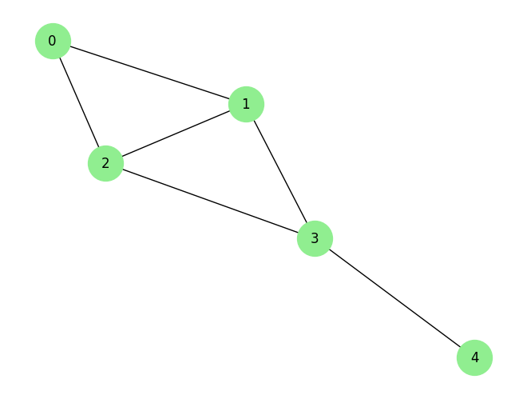
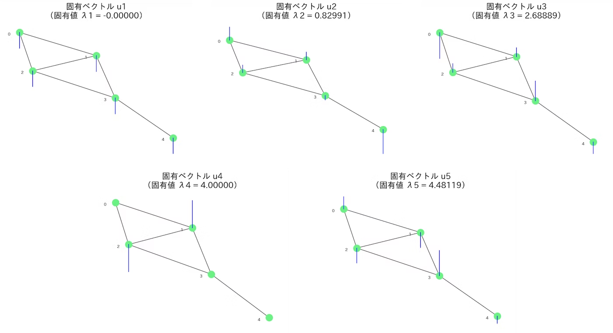
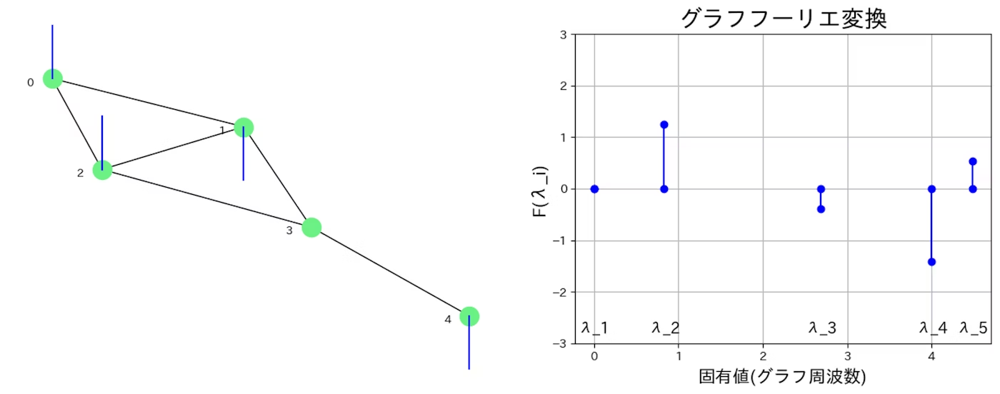
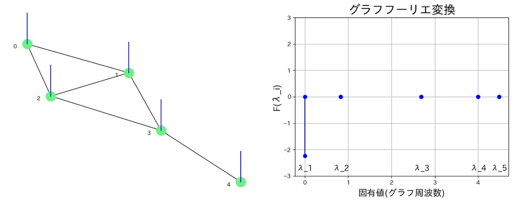
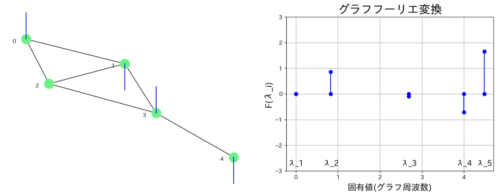
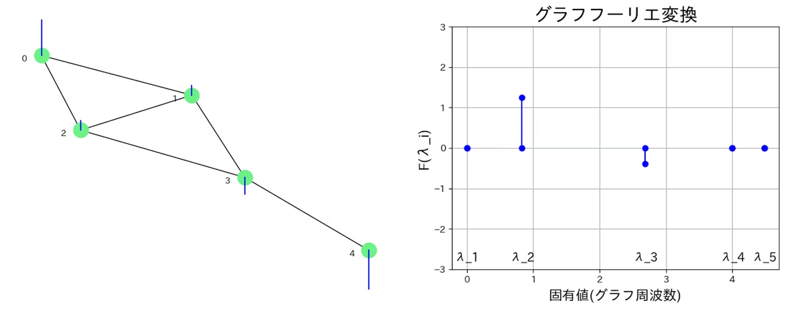
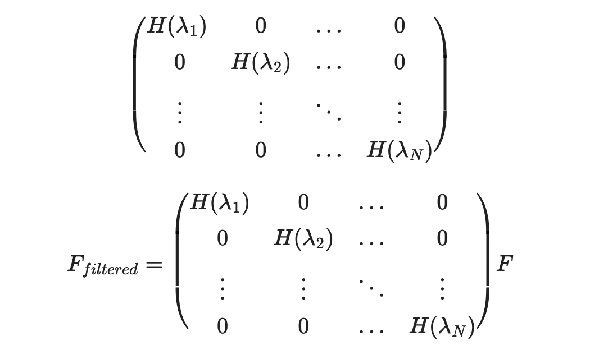
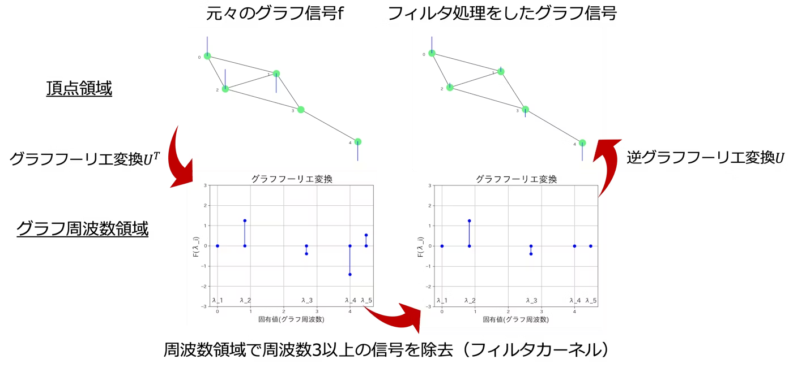

# 1. GNN および GCN

## 1.1. 　グラフニューラルネットワーク(GNN)とは

グラフニューラルネットワークとは、グラフデータをニューラルネットワークで扱うものの総称

(※GNN という元々 model があったが、最近では広義的な意味で使用されている)

### 1.1.1. 　使用例

- 化学反応の予測
- レコメンドシステム
  - ユーザーとアイテムの関係性（クリックしたか・購入したか・お気に入り登録したか等）をグラフの辺としてみなす
  - このグラフ構造に対して GNN を適用することで、従来の手法よりも性能の高いレコメンドシステムを構成
    <!-- markdownlint-disable MD033 -->
    

      
      

### 1.1.2. GNN(model) の構成

1. 学習データとなるグラフを入力
2. 入力として与えられたグラフに対して、「GNN Layer」を複数適用
3. 得られた埋め込み表現(Embedding)を用いて学習時に損失(loss)を計算したり、推論時に予測

## 1.2. GNN と GCN の違い

### 1.2.1. GNN

- 特徴
  - グラフ構造を持つデータに対してノードやエッジの特徴量を再帰的に更新するためのネットワーク
  - 固定された関数とパラメータによって特徴量を更新
  - 一つのモデルで同じパラメータを使用
  - ノードとエッジの情報を考慮して特徴量を更新

### 1.2.2. GCN

- 特徴
  - グラフ構造を持つデータに対して畳み込みニューラルネットワークを適用する手法
  - 多層構造で各層で異なるパラメータを用いて特徴量を更新
  - 各層で異なるパラメータを使用するため、モデルの表現力が高まる
  - ノード間の関係を考慮して特徴量を更新

### 1.2.3. 　相違点

- GNN では、固定された関数および、固定されたパラメータで特徴量を更新するが、GCN では、多層構造で各層で異なるパラメータを用いて特徴量を更新
- GNN では、畳み込みを行わない。GCN では、フィルタの畳込みをグラフ上で行う
  - 畳み込み：局所的な特徴量の抽出。画像では隣接するピクセル間の関係性があり、エッジや色の変化といった局所的な特徴を検出。グラフでは、隣接するノードから注目ノードの特徴量を検出
    
- 実用上では、GCN の方が使われる?(場合により)

#### 補足

- グラフ畳み込みの 2 つのアプローチ
  - Spectral-based
    - グラフ信号処理の立場からフィルタを導入してグラフ畳み込みを定義
    - 長所・短所:理論的な裏付け・行列の固有値分解が計算量大
  - Spatial-based
    - 近傍のノードから特徴情報を集める処理としてグラフ畳み込みを定義
    - 長所・短所:直感的に理解しやすい・非常に多くのバリエーション

そもそも、広義的な GNN は以下の数だけある

  

## 1.3. 数式を用いた説明

### 1.3.1. 前提

- グラフ $G=(V, E)$

- 隣接行列 $\boldsymbol{A} = (a_{ij})$

$$
\begin{equation}
a_{ij} =
\begin{cases}
1   &   ((i,j)\in E) \\
0   &   (otherwise)
\end{cases}
\end{equation}
$$

を満たす重みなしのグラフを考える

隣接行列　$\boldsymbol{A}$

$$
\begin{pmatrix}
0 & 1 & 1 & 0 & 0 \\
1 & 0 & 1 & 1 & 0 \\
1 & 1 & 0 & 1 & 0 \\
0 & 1 & 1 & 0 & 1 \\
0 & 0 & 0 & 1 & 0 \\
\end{pmatrix}
$$

次数行列　$\boldsymbol{D}$

$$
\begin{pmatrix}
2 & 0 & 0 & 0 & 0 \\
0 & 3 & 0 & 0 & 0 \\
0 & 0 & 3 & 0 & 0 \\
0 & 0 & 0 & 3 & 0 \\
0 & 0 & 0 & 0 & 1 \\
\end{pmatrix}
$$

ラプラシアン行列
$\boldsymbol{L} = \boldsymbol{D} - \boldsymbol{A}$

$\boldsymbol{D}$: 次数行列(degree matrix)

ラプラシアン行列　$\boldsymbol{L}$

$$
\begin{pmatrix}
2 & -1 & -1 & 0 & 0 \\
-1 & 3 & -1 & -1 & 0 \\
-1 & -1 & 3 & -1 & 0 \\
0 & -1 & -1 & 3 & -1 \\
0 & 0 & 0 & -1 & 1 \\
\end{pmatrix}
$$

正規化ラプラシアン行列
$\boldsymbol{\mathcal{L}} = \boldsymbol{D}^{- \frac{1}{2}}  \boldsymbol{L} \boldsymbol{D}^{- \frac{1}{2}} = \boldsymbol{I} - \boldsymbol{D}^{- \frac{1}{2}}  \boldsymbol{A} \boldsymbol{D}^{- \frac{1}{2}}$

$\boldsymbol{D}^{- \frac{1}{2}}$ の計算

$$
\begin{equation}
  \boldsymbol{D}^{- \frac{1}{2}} =
  \begin{pmatrix}
    0.70710678 & 0 & 0 & 0 & 0 \\
    0 & 0.57735027 & 0 & 0 & 0 \\
    0 & 0 & 0.57735027 & 0 & 0 \\
    0 & 0 & 0 & 0.57735027 & 0 \\
    0 & 0 & 0 & 0 & 1 \\
  \end{pmatrix}
\end{equation}
$$

値が大きいほど、$-\frac{1}{2}$乗の値が小さくなる
ここから、正規化ラプラシアン行列を計算すると、

$$
\begin{equation}
  \boldsymbol{\mathcal{L}} =
  \begin{pmatrix}
    1 & -0.40824829 & -0.40824829 & 0 & 0 \\
    -0.40824829 & 1 &  -0.33333333 &  -0.33333333 & 0 \\
    -0.40824829 &  -0.33333333 & 1 & 0 & 0 \\
    0 &  -0.33333333 &  -0.33333333 & 1 & -0.57735027 \\
    0 & 0 & 0 & -0.57735027 & 1 \\
  \end{pmatrix}
\end{equation}
$$

対角成分が全て 1、非対角成分では-1

$$
\begin{equation}
  \boldsymbol{\mathcal{L}}[i, j] =
  \boldsymbol{\mathcal{L}}[j, i] =
  \frac{-1}{\sqrt{ノードiの次数}\sqrt{ノードjの次数}}
\end{equation}
$$

次数の高いノードに関係するエッジほど値が小さくなる
**次数の高いノード間を繋ぐエッジほど重みが小さく，次数の低いノード間を繋ぐエッジほど重みが大きく**
$\boldsymbol{\mathcal{L}}[1, 2] = -0.333...$
$\boldsymbol{\mathcal{L}}[0, 1] = -0.408...$
$\boldsymbol{\mathcal{L}}[3, 4] = -0.577...$ ← ノード ④ は次数が低いので一番重くなる

### 1.3.2.グラフラプラシアンの固有値分解

ノードの数$\boldsymbol{N}$とする。
また、グラフラプラシアン$\boldsymbol{L}$を固有値分解すると、固有ベクトル$\mathcal{u}_1,\mathcal{u}_2,\mathcal{u}_3..., \mathcal{u}_{\boldsymbol{N}}$と、固有値$\lambda_1, \lambda_2,..., \lambda_{\boldsymbol{N}}$が得られる。

ラプラシアン行列　$\boldsymbol{L}$

$$
\begin{pmatrix}
2 & -1 & -1 & 0 & 0 \\
-1 & 3 & -1 & -1 & 0 \\
-1 & -1 & 3 & -1 & 0 \\
0 & -1 & -1 & 3 & -1 \\
0 & 0 & 0 & -1 & 1 \\
\end{pmatrix}
$$

この固有値分解は、
$[\lambda_1, \lambda_2, \lambda_3, \lambda_4, \lambda_5]= [0, 0.82991, 2.68889, 4, 4.48119]$
これらに対応する固有ベクトルは、

$$
\begin{equation}
  \boldsymbol{U} =
  [u_1, u_2, u_3 u_4, u_5] =
  \begin{pmatrix}
    -0.44721 &  0   & -0.70308  & 0         & 0.338 \\
    -0.44721 &  0.25597   & 0.24217   & 0.70711   & -0.41932 \\
    -0.44721 &  0.25597   & 0.24217   & -0.70711  & -0.41932 \\
    -0.44721 &  -0.13802  & 0.53625   & 0         & 0.70242 \\
    -0.44721 &  -0.81146  & -0.31752  & 0         & -0.20177 \\
  \end{pmatrix}
\end{equation}
$$

**固有値が小さいほど変化が小さく，固有値が大きいほど変化が大きい**ことが分かる
グラフラプラシアンの固有値$\lambda$は、グラフの周波数
グラフラプラシアンの固有ベクトル$u$は、グラフのフーリエ基底
と見れる。
また、グラフラプラシアンは実対称行列であるため、固有ベクトル同士は、正規直交基底となる。

### 1.3.2.グラフフーリエ変換

まず、通常の時系列のフーリエ変換は、

$$
\begin{equation}
 {F}(\omega) = \int_{-\infty}^{\infty} f(t) * e^{-j\omega t}dt
\end{equation}
$$

$$
\begin{equation}
  f(t) =\frac{1}{2\pi} \int_{-\infty}^{\infty}{F}(\omega) * e^{j\omega t}dt
\end{equation}
$$

時系列フーリエ変換では、固有関数である $\boldsymbol{e^{j\omega t}}$ とシグナル $\boldsymbol{f(t)}$ の積の積分である。これを、グラフに対応すると、**固有ベクトルとグラフシグナルの積の和**として、考えることができる。

グラフシグナルの(例)

- 交通ネットワーク：各ノードが交差点や駅を表し、エッジが道路や鉄道を表す場合、通行量や遅延時間などの交通情報がグラフシグナルとなる。
- インターネット：各ノードがウェブサイトを表し、エッジがハイパーリンクを表す場合、ウェブサイトの訪問者数やページランクなどの情報がグラフシグナルとなる。
- 気象ネットワーク：各ノードが地理的な位置（都市や地域）を表し、エッジがそれらの間の気象パターンの相関を表す場合、気温、湿度、風速などの気象データが各ノードに紐づく値となり、これらはグラフシグナルとななる。

これでグラフフーリエ変換の式を理解することができる。

$$
\begin{equation}
  F(\lambda_i) = \sum_{k=0}^{N-1}f(k) * u_{\lambda_i}(k)
\end{equation}
$$

グラフフーリエ変換では、解析したいグラフシグナルについて、 $u_1, u_2, ..., u_N$ という基底を固有値領域においてそれぞれ程度の量を持っているか調べる。

**グラフフーリエ変換によって，グラフ信号を周波数解析することが可能**となった。

### 1.3.3 グラフのフィルタリング

先ほどの例にローパスフィルタをかける。

ローパスフィルタなので、グラフ周波数が３以上をフィルタにかける。よって、$\lambda_4 = \lambda_5 = 0$ となる。
また、逆グラフフーリエ変換をすることで、フィルタがかけられた信号を出力する。
$$
\begin{equation}
  f(k) =
  \sum_{i=0}^{N-1}F(\lambda_i) * u_{\lambda_i}(k)
\end{equation}
$$

### 1.3.4 まとめ

グラフラプシアン$L$の固有値分解は、
$$
\begin{equation}
  L =
  U \mathcal{H} U
\end{equation}
$$
なお、

$U := [u_1,u_2,...,u_N]$
$\mathcal{H} := [\lambda_1, \lambda_2,...,\lambda_N]$

#### グラフフーリエ変換の行列式に変換

$$
\begin{equation}
  F(\lambda_i) = \sum_{k=0}^{N-1}f(k) * u_{\lambda_i}(k)
\end{equation}
$$
これは、
$$
\begin{equation}
  F = U^Tf
\end{equation}
$$

また、逆フーリエ変換の行列式は
$$
\begin{equation}
  f = U^TF
\end{equation}
$$

#### 先ほどのフィルタリングの操作を行列式で行うと

  1. グラフ信号を周波数領域に変換

      $F = U^Tf$

  2. 周波数領域でフィルタリングなどの処理を行う．周波数領域でフィルタリングなどの処理を行う．
      

      $f_{filtered} = U^TF_{filtered}$

いかにフィルタカーネルを探すか...
→ 機械学習で見つける

例えば、分類タスクの場合だと、クロスエントロピーロスを使用して，ロスを逆伝搬したとする。

最適なフィルタは、($g_{\theta}(\mathcal{H})$)は、

$$
  \begin{equation}
    g_{\theta}( \mathcal{H}) =
    \begin{pmatrix}
    \Theta(\lambda_1) &  0          & \cdots  & \cdots  & 0 \\
    0         &  \Theta(\lambda_2)  & 0       & \cdots  & 0 \\
    \vdots    &  \vdots     & \ddots  & 0       & 0 \\
    \vdots    &  \vdots     & \vdots  & \ddots  & 0 \\
    0         &  0          & 0       & 0       & \Theta(\lambda_N)\\
    \end{pmatrix}
    =
    \begin{pmatrix}
    \theta_1  &  0          & \cdots  & \cdots  & 0 \\
    0         &  \theta_2   & 0       & \cdots  & 0 \\
    \vdots    &  \vdots     & \ddots  & 0       & 0 \\
    \vdots    &  \vdots     & \vdots  & \ddots  & 0 \\
    0         &  0          & 0       & 0       & \theta_N \\
    \end{pmatrix}
  \end{equation}
$$

これにより、$f_{filtered}$は、
$$
  \begin{equation}
    f_{filtered} = Ug_{\theta}(\mathcal{H})U^Tf
  \end{equation}
$$

### 1.3.5 問題点

グラフフーリエ変換では、グラフ全体の情報からノードiがどのようなグラフシグナルを持っているかを導出する。
つまり、**ノード$i$からみた時，ノード$j$が隣にあっても遠いところにあっても一緒**に見られる。
よって、近傍の情報を活用するようにフィルタカーネルを設計する。

### 1.3.6 多項式カーネル

フィルタカーネルを以下に設定
$$
  \begin{equation}
    g_{\theta}(\mathcal{H}) =
    \sum_{k=0}^{K-1}\theta_k\mathcal{H}^k
  \end{equation}
$$

$\mathcal{H} := [\lambda_1, \lambda_2,...,\lambda_N]$
であるため、
$$
  \begin{equation}
    g_{\theta}(\mathcal{H})
    =
    \begin{pmatrix}
      \theta_0 \lambda_1^0 + \theta_1 \lambda_1^1 + \cdots & 0 & \cdots & 0\\
      0 &  \theta_0 \lambda_2^0 + \theta_1 \lambda_2^1 + \cdots & \cdots & 0 \\
      \vdots & \vdots & \ddots & \vdots \\
      0 & 0 & \cdots &  \theta_0 \lambda_N^0 + \theta_1 \lambda_N^1 + \cdots\\
    \end{pmatrix}
  \end{equation}
$$

- $\mathcal{H}^0$が0次近傍、自分自身
- $\mathcal{H}^1$が1次近傍、1つ隣のノード
- $\mathcal{H}^２$が2次近傍、2つ隣のノード
- $\mathcal{H}^k$がk次近傍、kつ隣のノード

また、$\theta$は、

- $\theta_0$が0次近傍の情報をどの程度使うのか(重み)
- $\theta_1$が1次近傍の情報をどの程度使うのか(重み)
- $\theta_k$がk次近傍の情報をどの程度使うのか(重み)

(例)
フィルタカーネルの最適化が以下である場合だと、
$\theta_0 = 0.3　\theta_1 = 0.5　\theta_2 = 0.1$
重要度は 1次近傍＞0次近傍＞2次近傍

### 1.3.7 計算量

グラフラプラシアン$L$の計算量が、$O(N^3)$
フィルタリングの行列演算が、$O(N^2)$
固有値分解は1回のみでいいが、フィルタリングの行列演算は、エポック数M(学習回数)回する必要があるため、$O(N^2M)$
ノードが増えれば増えるほど、計算量が大きくなる。

### 1.3.8 ChebNet（チェビシェフの多項式による多項式フィルタカーネルの近似）

多項式フィルタカーネルにおけるフィルタリングの計算量を$O(K|\bold{\epsilon}|)$に減らせる。$K$は近傍$K$で、$|\bold{\epsilon}|$がエッジの本数。多くのグラフでは、$N^2 > K|\bold{\epsilon}|$であるため計算量が小さくなる。
$\mathcal{T}_0(x) = 1　\mathcal{T}_1(x) = x　\mathcal{T}_k(x) = 2x\mathcal{T}_{k-1}(x) - \mathcal{T}_{k-2}$

今日はここまで！！！！　TODO：続き

### GNN の計算

ノード
$i$
の潜在ベクトル
$\boldsymbol{h}_i$
を求める

1. 学習される関数である
   $\mathcal{F()}$
   を用いて, 潜在ベクトル
   $\boldsymbol{h}_i$
   が収束するまで次の式を適用. これによってノード
   $i$
   の周辺の特徴を取り込む。

   $\boldsymbol{h}\_i \leftarrow  \sum_{j \in \mathcal{N}(i)} \mathcal{F}(\boldsymbol{h}_i, \boldsymbol{h}_j, \boldsymbol{F}_i^V, \boldsymbol{F}_j^V,\boldsymbol{F}^E _{i, j})$

   $\mathcal{F}$: 学習される関数

   $\boldsymbol{F}^V, \boldsymbol{F}^E$:ノード、エッジの特徴

   $\mathcal{N}_i(k)$: ノード $i$ から距離 $k$ 以内にあるノードの集合

2. 学習される関数 $\mathcal{O()}$ であるを用いて, 出力を計算.

    $$
    \begin{equation}
    \hat{y}_i = \mathcal{O}(\boldsymbol{h}_i \boldsymbol{F}_i^V)
    \end{equation}
    $$

重みは, $\hat{y}_i$と教師ラベルの誤差を最小化するようにステップ 1, 2 と誤差逆伝搬を繰り返すことで学習される

### GCN の計算

- 入力
  - 隣接行列
    $\boldsymbol{A} \in \mathbb{R}^{n \times n}$
    - どのノードとどのノードが繋がっているかを表す行列。
  - 特徴行列
    $\boldsymbol{X} \in \mathbb{R}^{n \times |X|}$
    - 各ノードの特徴ベクトルを表す行列。
- 出力
  - 潜在行列
    $\boldsymbol{H}_{out} \in \mathbb{R}^{n \times |H|}$
    - 各ノードの潜在表現ベクトルを表す行列。(GCN による変換済)

$$
\begin{equation}
f(H^{(0)}, A) = ReLU(\hat{\boldsymbol{D}}^{-\frac{1}{2}}\hat{\boldsymbol{A}} \hat{\boldsymbol{D}}^{-\frac{1}{2}} \boldsymbol{X} \cdot \boldsymbol{W})
\end{equation}
$$

- $ReLU()$: ニューラルネットワークの活性化関数の一つ。入力が 0 以下の場合は 0 を、それ以外の場合は入力そのものを出力
- $\hat{\boldsymbol{A}}$: $\boldsymbol{A} + \boldsymbol{I}$
- $\boldsymbol{W}$: 重み行列
